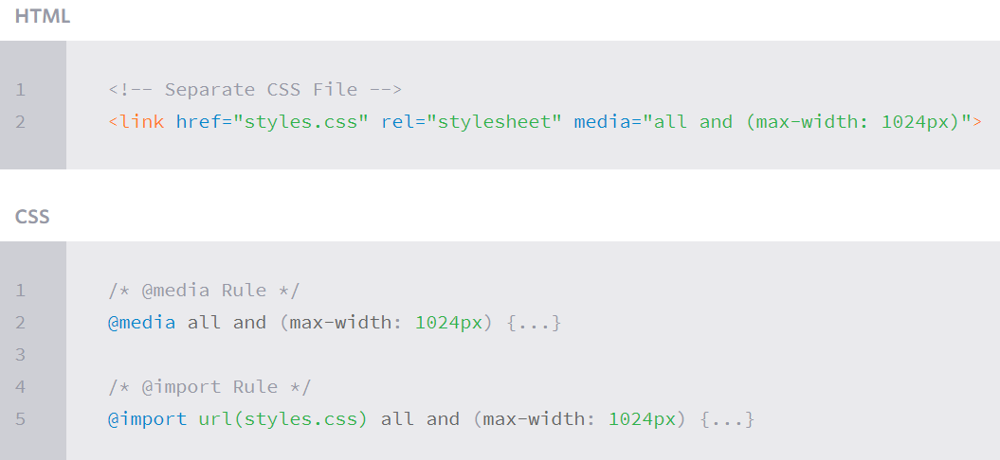
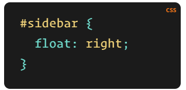
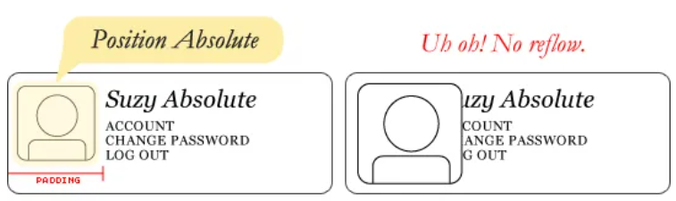
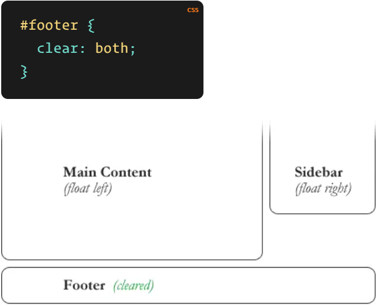

# Responsive Web Design

Is building a website to work on every device and every screen size, mobile or desktop,providing an intuitive and gratifying experience for everyone.

Responsive generally means to react quickly and positively to any change, while adaptive means to be easily modified for a new purpose or situation.

### Responsive web design components:

- flexible layouts: capable of dynamically resizing to any width.
- media queries.
- flexible media.

There are two ways to use media queries:

- the @media rule inside of an existing style sheet.
- linking to a separate style sheet from within the HTML document.

## Float 

Float is CSS positioning property when set the images into the page that text wraps around them as needed.or Ignoring the text wrap will allow the words to flow right over the image like it wasn’t even there.

And when use absolute positioning to page element will not affect the position of other elements and other elements will not affect them.

when use absolute position on avatar will not effected the text when the size change.

clearing the float will move itself down past the float.like this image:

### Problems with Floats

Most browsers will render the image outside the float, but not have the part sticking out affect other layout.

