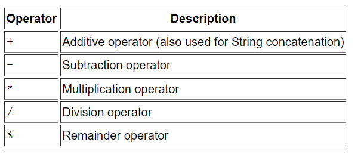

# Language Basics

### Variables

The Java programming language defines the following kinds of variables:

- Instance Variables (Non-Static Fields):  also known as instance variables because their values are unique to each instance of a class.
- Class Variables (Static Fields): class variable is any field declared with the static modifier `static int numGears = 6`, the keyword `final` could be added to indicate that the number of gears will never change.
- Local Variables: is between the opening and closing braces of a method.they are not accessible from the rest of the class.
- Parameters: parameters are always classified as "variables" not "fields".

### Primitive Data Types

- byte ,short ,int ,long ,double ,float ,boolean ,char.

### Arrays

Each item in an array is called an element, and each element is accessed by its numerical index.

`int[] anArray;`

`anArray = new int[10];`

`anArray[0] = 100;`

### Operators



### IF-statment

is the most basic of all the control flow statements.if my condition true will run stetments in the blocks and if false will run statments in else .

```// the "if" clause: bicycle must be moving```
    ```if (isMoving){ ```
        ```// the "then" clause: decrease current speed```
        ```currentSpeed--; }```

### for loop 

for statement provides a compact way to iterate over a range of values. Programmers often refer to it as the "for loop" because of the way in which it repeatedly loops until a particular condition is satisfied.

The switch statement allows for any number of possible execution paths.


