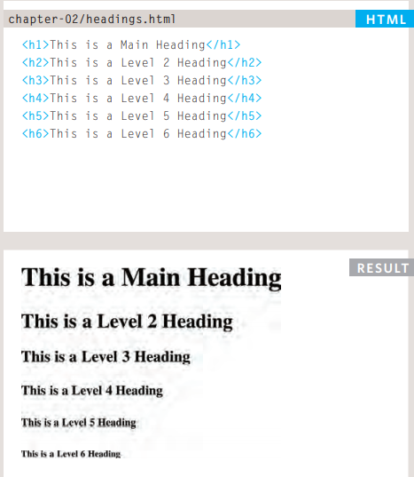
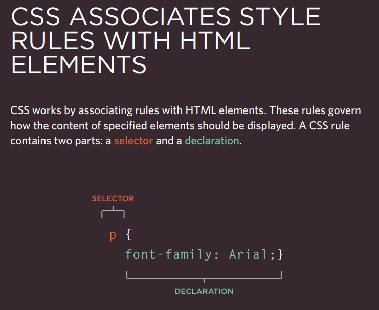
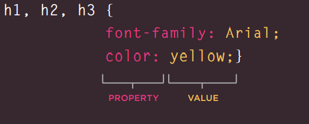
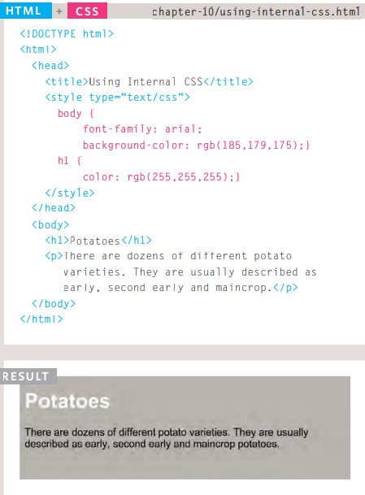
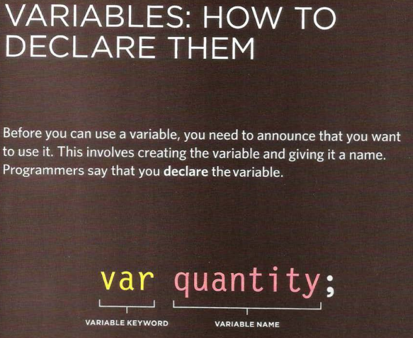
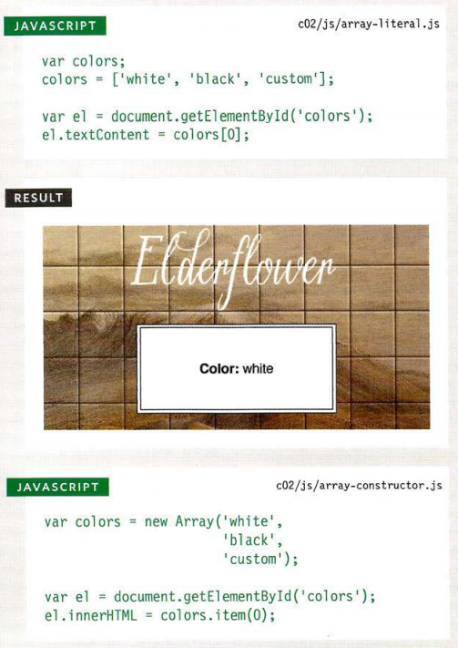

# Text

### heading

HTML has six "levels" of headings:
`<h1><h2><h3><h4><h5><h6>`

### Paragraphs

using to creat paragraph ,opening tag `
` and closing tag `
`

### Bold & Italic

By enclosing words in the tags `<b>` and `</b>` we can make characters appear bold.

By enclosing words in the tags `<i>` and `</i>` we can make characters appear italic.

### Superscript & Subscrip

```` : used to contain characters that should be superscrip.
```` : used to contain characters that should be subscript.

### Line Breaks & Horizontal Rules

- ` `
- `
`

### Semantic Markup

Strong & Emphasis:

`<strong>` - Important text
`<em>` - Emphasized text

Quotations:

`<blockquote>` - Defines a section that is quoted from another source
`<q>`- Defines a short inline quotation

Abbreviations & Acronyms

`<abbr>` - Defines an abbreviation or acronym

# Introducing CSS

CSS declarations sit inside curly brackets and each is made up of two
parts: a property and a value, separated by a colon. You can specify
several properties in one declaration, each separated by a semi-colon.

### Using External CSS

links:

`href` : This specifies the path to the CSS file (which is often placed in a folder called css or styles).

### Using Internal CSS

CSS rules usually appear in a separate document, although they may appear within an HTML page.

# Javascript Instructions:

### STATEMENTS :

Each individual instruction or step is known as a statement. Statements should end with a semicolon. 

`var today= new Date{);`

`var hourNow = today.getHours{) ;`

`var greeting;`

### COMMENTS :

You should write comments to explain what your code does. They help make your code easier to read and understand.
This can help you and others who read your code.

### VARIABLE :

### ARRAYS :

An array is a special type of variable. It doesn't just store one value; it stores a list of values.

JavaScript distinguishes between numbers (0-9), strings (text), and Boolean values (true or false). 

Comparaison operators evaluating conditions:
Equal to
`'hello' == 'hello'` the answer is true

Not equal to
`'hello' != 'hello'` the answer is false

Strict equal to
`'3' === 3` return false but '3' === '3' return false

check that both the data type and value are the same
Strict not equal to
`'3' !== '3'` return false

Greater than
`4 > 3` return true

Less than
`4 < 3` return false

Greater than or equal to
`4 >= 3` return true and 4 >= 4 return true

Less than or equal to
`4 <= 3` return false

### Logical operators allow you to compare the results of more than one comparison operator.

- `((5<2) && (2>=3))` return false
- `((5<2) || (2<=3))` return true
- `!(5<2)` true

