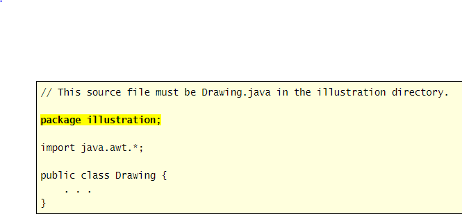

# Packages and Import

`Package = directory` contains the .java files, package declaration must be first statment and after that can import statments help to specify classes from other packages.

### import 

- `import javax.swing.*;` when write * all classes that located in swing available to use in another program. 
- `import javax.swing.JOptionPane;` just JOptionPane method available in my program.
- `javax.swing.JOptionPane.showMessageDialog(null, "Hi");` write packages name and the method in my code.

### Common imports

- import java.awt.*;	Common GUI elements.
- import java.awt.event.*;	The most common GUI event listeners.
- import javax.swing.*;	More common GUI elements. Note "javax".
- import java.util.*;	Data structures (Collections), time, Scanner, etc classes.
- import java.io.*;	Input-output classes.
- import java.text.*;	Some formatting classes.
- import java.util.regex.*;	Regular expression classes.

### For loop

allow us to repeat some instructions to do specific goal.

### While Loop

can run the statment inside the while blocks and repeat them if boolean expression is true.

