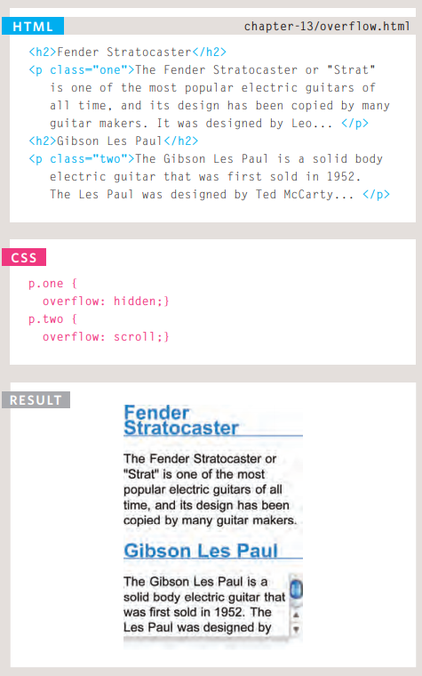
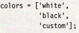
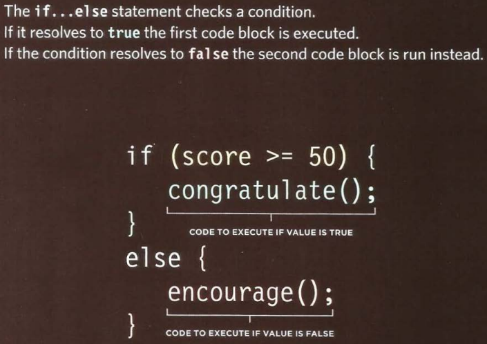

# Lists

HTML provides us with three different types of lists:

- Ordered lists :

`<ol></ol>`and write `<li><li>`inside it.

are lists where each item in the list is numbered.

- Unordered lists :

`<ul></ul>`and write `<li></li>`inside it.

 are lists that begin with a bullet point.

- Definition lists :

 are made up of a set of terms along with the definitions for each of those terms.

 `<dl></dl>`and write inside it `<td></td>`then after `<td></td>`will write `<dd></dd>` This is used to contain the definition.

 - Nested Lists :

 

 # Boxes

### Border, Margin and Padding

1. border :  The border separates the edge of one box from another.
1. margin :  The sit outside the edge of the border.
1. badding :  the space between the border of a box and any content contained within it.

we can change colors and dimensions and alot of styles can change on it.

Block-level boxes can be made into inline boxes, and inline boxes made into block-level boxes.

CSS3 has introduced the ability to create image borders and rounded borders.

# ARRAYS

You should consider using an array whenever you are working with a list or a set of values that are related to each other.

can write array like this:

# IF Statments

# Loops

Loops check a condition if it return true, a code block will run
then check the condition again if still returns true the code block will
run again. It repeats until the condition returns false.

1. For 

`var i;

`for (i = 0; i < 10; i++){write code goes here}`

1. While

`var rounds = 3;`

`i < (rounds);`

1. Do while

`var i = 1;`

`do{`

`msg += i + ' x 5 = ' + (i*5) + ' ';`

`i++`

`}while (i <1)`;

`document.getElementById('answer').innerHTML = msg;`

1. Take variable called msg 
1. Add to the following to its value
1. The number in the counter 
1. Write out the string x 5 =
1. The counter multiplied by 5
1. Add a line break

