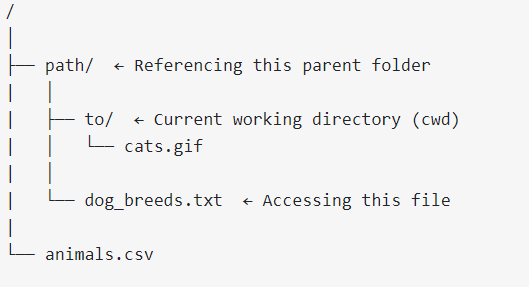
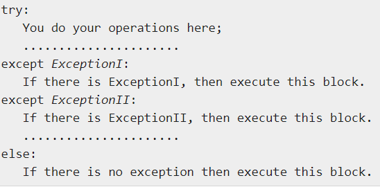

# What Is a File?

 file is a set of bytes used to store data,these byte files are then translated into binary 1 and 0 for easier processing by the computer.

 file systems are composed of three main parts:

- Header: metadata about the contents of the file (file name, size, type)
- Data: contents of the file as written by the creator or editor
- End of file (EOF): special character that indicates the end of the file

file path have three parts:

- Folder Path
- File Name
- Extension

Python provides two features to handle any unexpected error in Python programs and to add debugging capabilities in them −

- Exception Handling 
- Assertions 

Exception : An exception is an event, which occurs during the execution of a program that disrupts the normal flow of the program's instructions.

assertion : An assertion is a sanity-check that you can turn on or turn off when you are done with your testing of the program.

