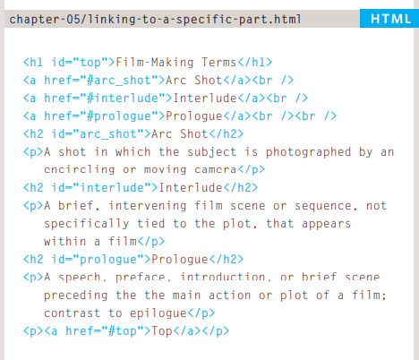
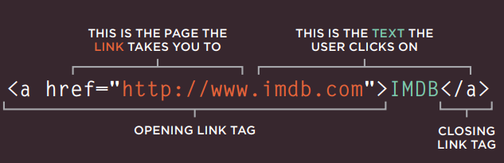
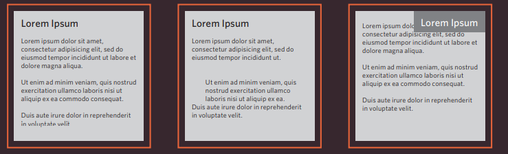
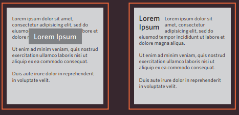
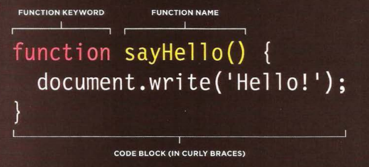
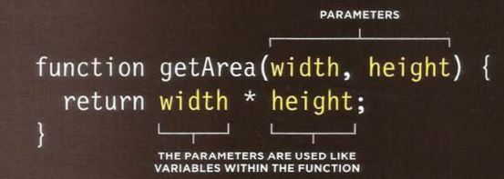
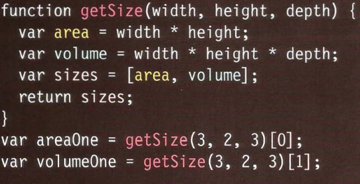

# Links

You will commonly come across the following types of links:
- Links from one website to another : give the element `ID` and call it by write `#` like this 

- Links from one page to another on the same website
- Links from one part of a web page to another part of the same page : Relative URLs can be used when linking to pages within your own
website.

- Links that open in a new browser window : If you want a link to open in a new window, you can use the target attribute on the opening `<a>` tag. The value of this attribute should be _blank.

- Links that start up your email program and address a new email to someone

writing linkes by `` and can write the link inside href.

You can create links to open email programs with an email address in the "to" field.

# Layout

### Key Concepts in Positioning Elements

- Block-level elements start on a new line Examples include: `<h1> 
 <ul> <li>`
- Inline elements flow in between surrounding text Examples include: ` <b> <i>`

###  positioning schemes

- Normal flow
- Relative Positioning
- Absolute positioning

may also need to use box offset properties to tell the browser how far from the top or bottom and left or right it should be placed

-Fixed Positioning
- Floating Elements

Pages can be fixed width or liquid (stretchy) layouts.

CSS Frameworks provide rules for common tasks.

# FUNCTION

group a series of statements together to perform a specific task.

and can call the function by `nameFunction();`

when you want to add data in function by prameters like this:

and can we call functions have a parameter by `nameFunction(parameter1,parameter2);`

and can do operations in the body inside the function like this:

