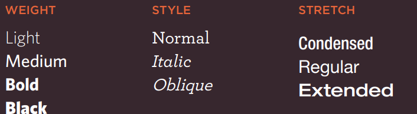

# Images

### Adding Images

To add img into the page should to use `` inside it write `src` to put the URL of image
also `alt` it used to provide text description of the image if you can not see it.

Also can change size of images by height & width like this:

### Place Images in Your Code

1. before a paragraph
2. inside the start of a paragraph
3. in the middle of a paragraph

### Aligning Images Horizontally

- left : This aligns the image to the left (allowing text to flow around its right-hand side).
- right : This aligns the image to the right (allowing text to flow around its left-hand side).

### Aligning Images Vertically

- top : This aligns the first line of the surrounding text with the top of the image.
- middle : This aligns the first line of the surrounding text with the middle of the image.
- bottom : This aligns the first line of the surrounding text with the bottom of the image.

### Three Rules for Creating Images

- Save images in the right format
- Save images at the right size
- Use the correct resolution

You should save images at the size you will be using them on the web page and in the appropriate format.

# Color

### Foreground color

The color property allows you to specify the color of text inside
an element. You can specify any color in CSS in one of three ways:

1. rgb values

`p {`
`color: rgb(100,100,90);}`

 how much red, green and blue are used to make it up.

2. hex codes

`h2 {`
`color: #ee3e80;}`

These are six-digit codes that represent the amount of red,
green and blue in a color.

3. color names

`h1 {`
`color: DarkCyan;}`

There are 147 predefined color names that are recognized
by browsers.

### Background color

`body {`
`background-color: rgb(200,200,200);}`

`h1 {`
`background-color: DarkCyan;}`

`h2 {`
`background-color: #ee3e80;}`

`p {`
`background-color: white;}`

### Contrast

- Low Contrast

Text is harder to read when there is low contrast between
background and foreground colors.

- High Contrast

Text is easier to read when there is higher contrast between
background and foreground colors.

- Medium Contrast

For long spans of text, reducing the contrast a little bit improves
readability.

### Opacity

introduces the opacity property which allows you to
specify the opacity of an element and any of its child elements.
The value is a number between 0.0 and 1.0 (so a value of 0.5
is 50% opacity and 0.15 is 15% opacity).

### HSL Colors

1. hue

. In HSL colors, hue is often
represented as a color circle
where the angle represents the
color.

2. saturation

Saturation is the amount of
gray in a color.

3. lightness

Lightness is the amount of
white (lightness) or black
(darkness) in a color.

# Text

### Typeface Terminology

        |        
--------| --------
Serif | 
Sans-Serif | 
Monospace | 

You can control the space between lines of text, individual letters, and words. Text can also be aligned
to the left, right, center, or justified. It can also be indented.

You can use pseudo-classes to change the style of an element when a user hovers over or clicks on text, or
when they have visited a link.