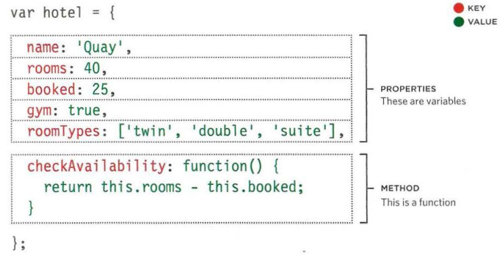
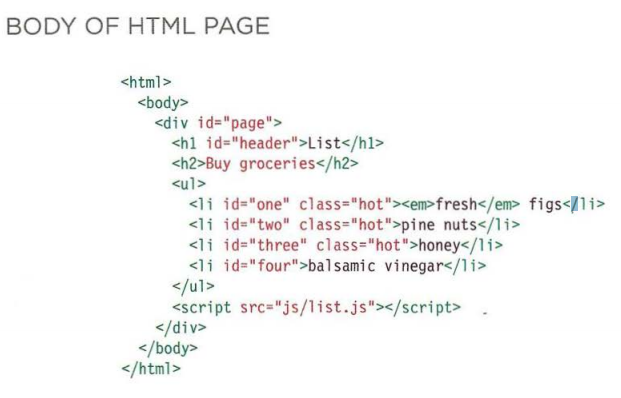
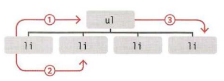
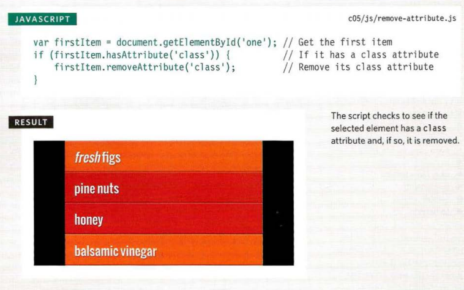

# Object

### What is an object?

 group of variables and functions we will recognize . 

- Variables are as properities.
- Functins are as methods.

### Programmers use a lot of name/value pairs:

- HTML uses attribute names and values.
- CSS uses property names and values.

In JavaScript:

- Variables have a name  value of a string, number, or Boolean.
- Arrays have a name and a group of values.
- Name functions have a name and value and to run if the function is called.
- Objects consist of a set of name and value pairs.

### Literal notation 

Literal notation is use to way tocreate objects.

You access the properities or methods of an object using dot notation and square brackets.

# Document Object Model (DOM)

DOM tree is stored in the browsers' memory. It consists of four main types of nodes.

Accessing and updating the DOM tree involves two steps:

1. detremain the ID or CLASS that represents the element you want to work with.
2. Use its text content and child elements.

How to select tagsfrom HTML to javascript:

REMOVING ATTRIBUTES

In older browsers, implementation of the DOM is inconsistent (and is a popular reason for using jQuery). 

An element node can contain multiple text nodes and child elements that are siblings of each other. 

