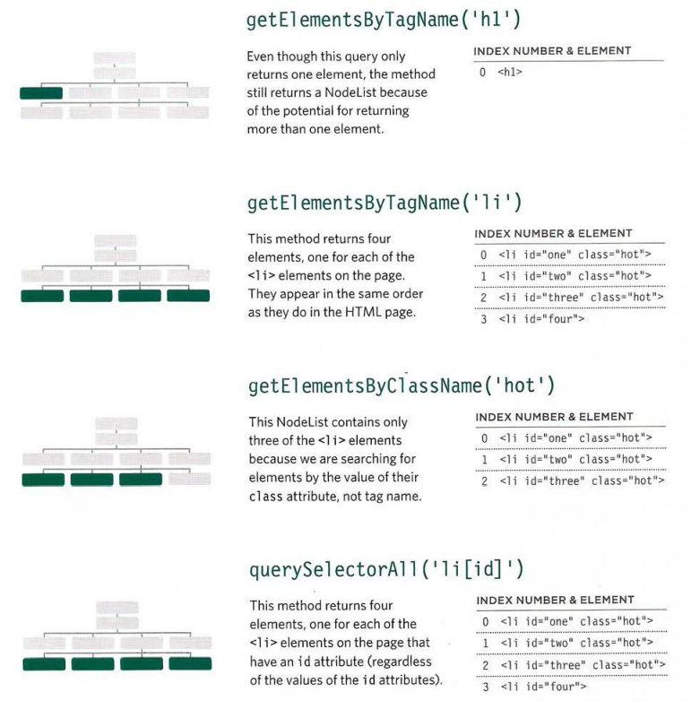

# Object

### What is an object?

Objects group together a set of variables and functions to create a model of a something you would recognize from the real world. In an object, variables and functions take on new names. 

- Variables become known as properities.
- Functins become known as methods.

### Programmers use a lot of name/value pairs:

- HTML uses attribute names and values.
- CSS uses property names and values.

In JavaScript:

- Variables have a name and you can assign them a value of a string, number, or Boolean.
- Arrays have a name and a group of values. (Each item in an array is a name/value pair because it
has an index number and a value.)
- Named functions have a name and value that is a set of statements to run if the function is called.
- Objects consist of a set of name/value pairs (but the names are referred to as keys).

### Literal notation 

Literal notation is easiest and most popular way tocreate objects.

You access the properities or methods of an object using dot notation also you can access properties using square brackets.

# Document Object Model (DOM)

specifies how browsers should create a model of an HTML page and how JavaScript can access and update the contents of a web page while it is in the browser window. 

DOM tree is stored in the browsers' memory. It consists of four main types of nodes.

Accessing and updating the DOM tree involves two steps:

1. Locate the node that represents the element you want to work with.
2. Use its text content, child elements, and attributes.

DOM queries may return one element, or they may return a Nodelist, which is a collection of nodes. 

SELECTING AN ELEMENT FROM A NODELIST :

- Select elements that have a cl ass attribute whose value is hot and store the Nodelist in a variable called e 1 ements. 

- Use the 1 ength property to check how many elements were found. If 1 or more are found, run the code in the if statement. 

- Store the first element from the Node List in a variable called fi rstitem. (It says 0 because index numbers start at zero.)

### TRAVERSING THE DOM

- `parentNode`
- `previousSibling nextSibling`
- `firstChil d lastChild `

When you have an element node, you can select
another element in relation to it using these five
properties. This is known as traversing the DOM.

REMOVING ATTRI BUTES

In older browsers, implementation of the DOM is inconsistent (and is a popular reason for using jQuery). 

An element node can contain multiple text nodes and child elements that are siblings of each other. 

