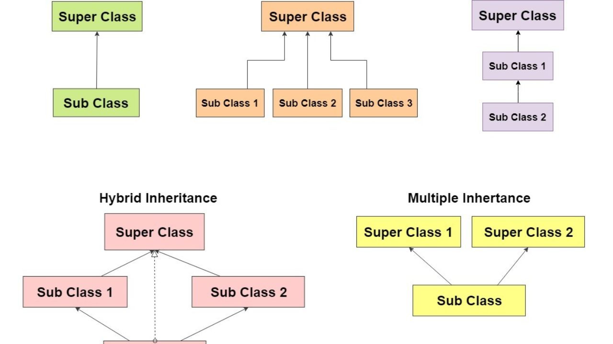

### Object

object stores its state in fields(fields represent the object stats),and exposes its behavior through methods.and data encapsulation It can't be accessed if it is private.

- Modularity: can create object and the source of object maintained independently of the source code for other objects.
- the details of its internal implementation remain hidden from the outside world.

#### class is the blueprint from which individual objects are created.

### Inheritance we use it when we creat class need same fields or same functions.`extends `, `class MyClass extends MySuperClass`.

class that is derived from another class is called a subclass.

### package allow to keep HTML pages in one folder, images in another, and scripts or applications in yet another same the folder in computers.

### interface : referance type ,similar classes.and modifiers `interface`.

method signatures have no braces and are terminated with a semicolon, and when we want to use interface class write the class implement the interface class, interface can extend other interfaces.
- interface name can be used anywhere a type can be used.

