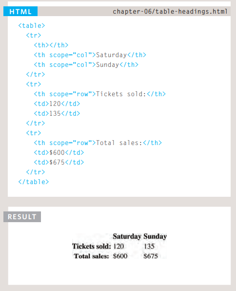
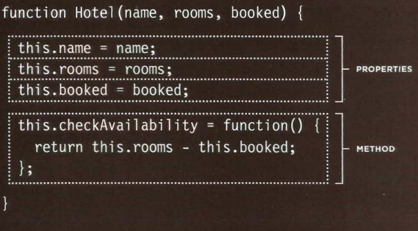

# Tables

### Basic Table Structure
- `<table>` : element tag to create table.
- `<tr>` : start the table using it.(table row).
- `<td>` : to write the table data.
- `<th>` : table heading  to represent the heading for either a column or a row.

Also we can do spanning columns and spanning rows in the table to stretch across more than one column or rows.

### Long Tables

for long table can write the table inside these elements:

- `<thead>` : the heading of the table will written inside it .
- `<tbody>` : the body of the table will written inside it.
- `<tfoot>` : the footer of the table will written inside it. (like:total).

# Javascript

can update the properites by dot or squere brackets.
also can use methods as templete for creating new objects when the function has parameter 

can we delete properities by delete then dot then name of properity.

- THIS : is key use inside the functions.

we can use array for organize the data.

### DATA TYPES REVISITED

1. String :will reseve string if properity was string.
2. Number : will reseve number if properity was number.
3. Boolean : will reseve boolean if property was boolean true or false.
4. Undefined : if not have the value
5. Null :if not have the value
6. 0bject : will reseve object if properity was array or functions.

Web browsers implement objects that represent both the browser window and the document loaded into the browser window. 

