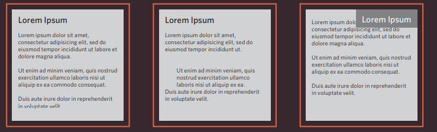

# Layout

### Key Concepts in Positioning Elements

- Block-level elements start on a new line : `<h1> 
 <ul> <li>`
- Inline elements flow inside between text : ` <b> <i>`

###  positioning schemes

- Normal flow : as normal text flow.
- Relative Positioning : can shift the content to left, right ,top ,bottom.
- Absolute positioning : can move when user scroll up and down.

also can use box offset properties to indicate where a box should be positioned:

-Fixed Positioning : not effect when user scroll top,bottom,right and left.
- Floating Elements

### Screen Sizes

When designing a web page, you must consider the size of the device users , ans the resolution is different from one device to another.

Fixed Width Layouts : used to don't change the size of the page when user do increases or decreases.

Layout Grids: used to organize the web page like this

Grids help create professional and flexible designs.

