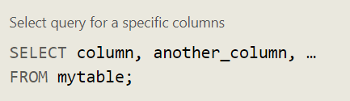
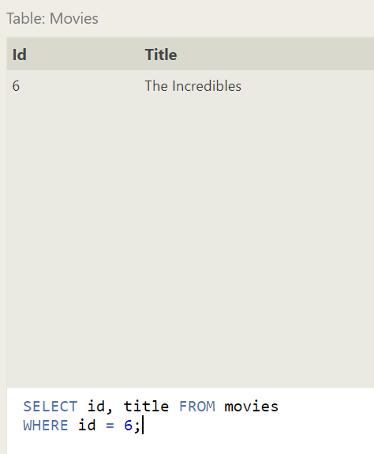
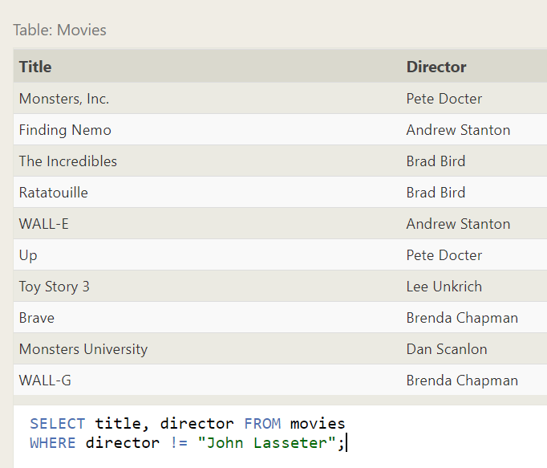

# SQL-Structured Query Language

is a language designed to allow both technical and non-technical users query, manipulate, and transform data from a relational database.

There are many popular SQL databases including SQLite, MySQL, Postgres, Oracle and Microsoft SQL Server.

# how to use SQL:

To retrieve data from a SQL database, we need to write SELECT statements, which are often colloquially refered to as queries. A query in itself is just a statement which declares what data we are looking for, where to find it in the database, and optionally, how to transform it before it is returned. It has a specific syntax though, which is what we are going to learn in the following exercises.

Select query for all columns `SELECT * FROM mytable;`

and can we select data by conditions on the specific columns of data from a table contain hundred rows by where:

SQL supports a number of useful operators to do things like case-insensitive string comparison and wildcard pattern matching like:

