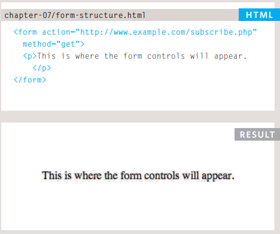
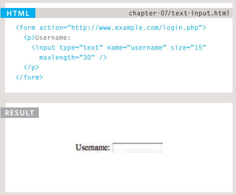
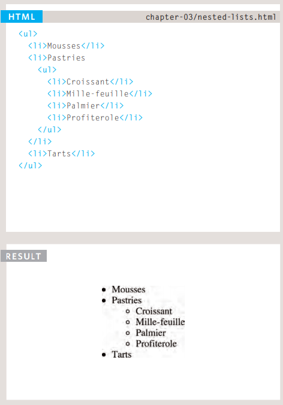
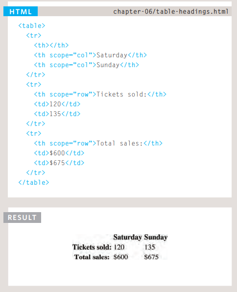

# Forms

Form : is place to search or choose or add text.

### Form Controls

- ADDING TEXT: like add Email , password.
- Making Choices: like Radio button or drop down box.
- Submitting Forms: like buttons .
- Uploading Files: like file upload.

### Form Structure

`<form>` then write inside form `action` to add URL this url found in server and when submitted the form will appear, then 
write `method` this will be get or post.

### Text Input

`<input>` then write `type` to write will be the input then `name` to know this form for what, also `max-length` to write size of area.

### Radio Button

Inside the input write `type` To determine if input radio or checkbox ,then `name` this send attrebute to server , then `value` to check the value in the server.

# List 

HTML provides us with three different types of lists:

- Ordered lists :
<ol></ol>and write <li><li>inside it.

are lists where each item in the list is numbered.

- Unordered lists :
<ul></ul>and write <li></li>inside it.

are lists that begin with a bullet point.

Definition lists :
are made up of a set of terms along with the definitions for each of those terms.

<dl></dl>and write inside it <td></td>then after <td></td>will write <dd></dd> This is used to contain the definition.

- Nested Lists :

# Table

Basic Table Structure
<table> : element tag to create table.
<tr> : start the table using it.(table row).
<td> : to write the table data.
<th> : table heading to represent the heading for either a column or a row.

Also we can do spanning columns and spanning rows in the table to stretch across more than one column or rows.

# Events

