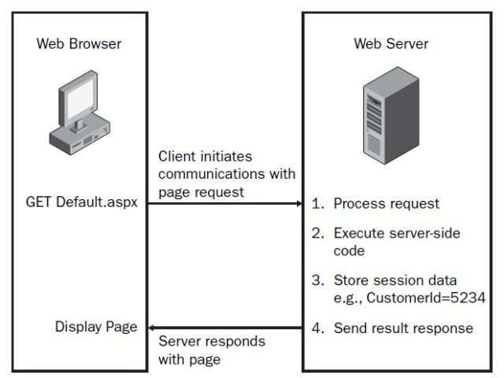

# The HTTP Request Lifecycle

 1. Local Processing: Depending on how in depth you want to get `<protocol>://<host><:optional port>/<path/to/resource><?query>` like that `|http|://|www.example.com||:5000||/mainpage||?query=param&query2=param2|`.the browser extract also the host and optional port number .

 2.  Resolve an IP

If the cache lookup fails (we will assume it does), your browser fires off a DNS request using UDP3. The DNS request contains the preconfigured IP for your DNS server and your return IP in its header. 

3. Establish a TCP Connection 

One of the key differences between TCP and UDP is that TCP ensures delivery and ordered data transmission. Much of this is done very simply, using what’s known as a sequence number for every byte sent.

4. Send an HTTP Request

5. Tearing Down and Cleaning Up

I didn't understand these step so I didn't write explanation about them .

