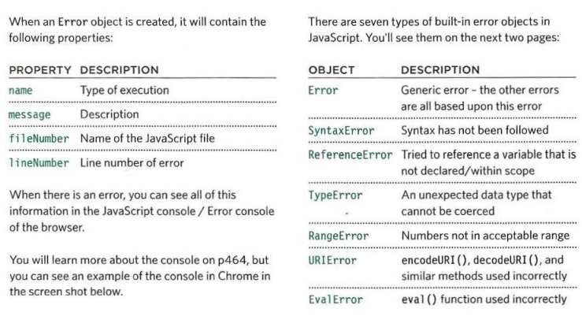
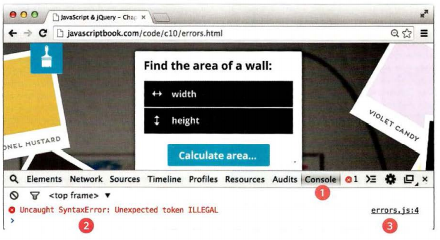
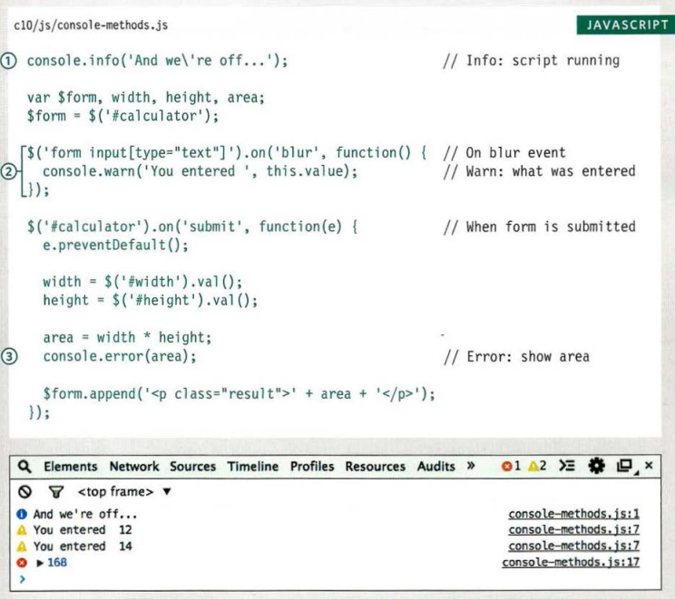
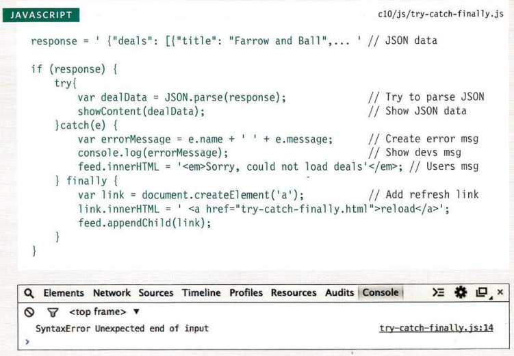

# Error Handling & Debugging

### ORDER OF EXECUTION

Sometimes we need to find the error in codes to can run the code, because if found statment wrong will not run the code.

### EXECUTION CONTEXT & HOISTING

1.  Prepare :when do variables, functions, and arguments .
2.  Execute :when run the code and excute statments and call the functins.

In this image find some errors in properties and in objects: 

And in when we faced any error javascript tell us the error and the line of error.

Can show errors by click right in the web page and click on console .

Can also write on console and will show you the result, and write `console.log` in javascript whis name of function or opatations and whis show result in console into web page.

### HANDLING EXCEPTIONS 

- `try`
- `catch`
- `finally`

Will add the code into try to execute, if there is any exception in catch will execute code find in it and in finally will execute the code found in it.

