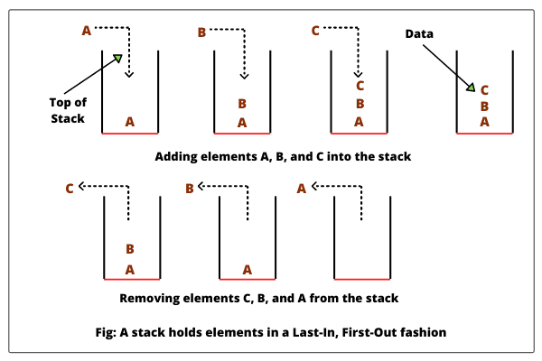

# Stacks and Queues

- Stacks: it's data structue contains nodes and each node reference to the next node not to the privious.

1. Push 
2. pop --> delete
3. top
4. peek

First In Last Out :first node intered in the stack will be last node pop from this stack.

Last In First Out :last node intered in the stack will be first node pop from this stack.

- Queue:  is a linear structure which follows a particular order in which the operations are performed.

1. Enqueue 
2. Dequeue 
3. Front 
4. Rear 
5. Peek 

First In First Out :first item intered in the queue will be first item out from this queue.

Last In Last Out :last item intered in the queue will be last item out from this queue.

