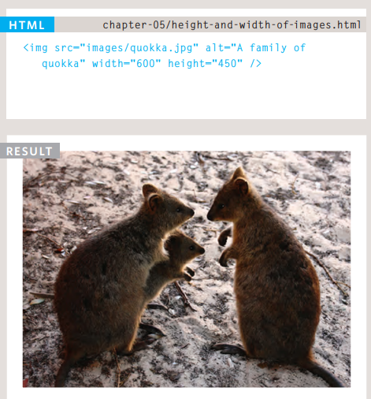

# Images

### Adding Images

To add img into the page should to use `` inside it write `src` to put the URL of image
also `alt` it used to provide text description of the image if you can not see it.

Also can change size of images by height & width like this:

### Place Images in Your Code

1. before a paragraph
2. inside the start of a paragraph
3. in the middle of a paragraph

### Aligning Images Horizontally

- left : This aligns the image to the left.
- right : This aligns the image to the right.

### Aligning Images Vertically

- top : This aligns the first line of the surrounding text with the top of the image.
- middle : This aligns the first line of the surrounding text with the middle of the image.
- bottom : This aligns the first line of the surrounding text with the bottom of the image.

We can add background img for the web page or backgroud for paragraph by writing `background-image: url("the link")`.

Also can property to the image like `repeat` , `no-repeat` , `fixed` and `scroll`.

 

