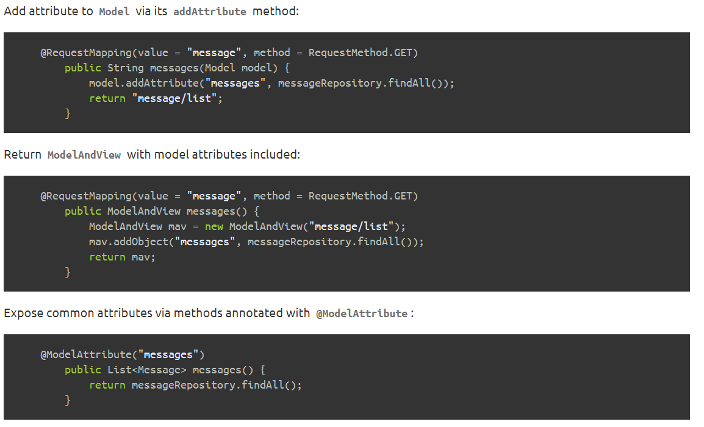
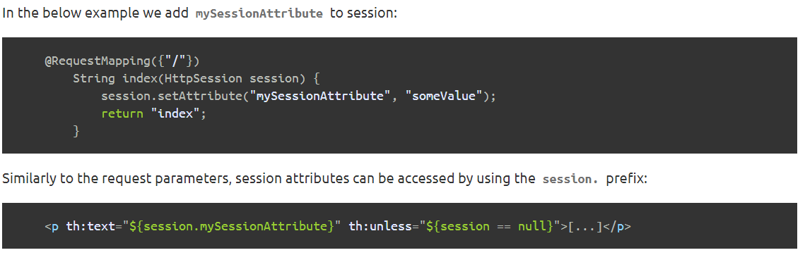
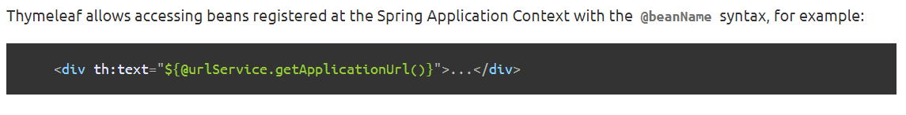

# Serving Web Content with Spring MVC

Thymeleaf is a Java template engine for processing and creating HTML, XML, JavaScript, CSS, and text.
The library is extremely extensible and its natural templating capability ensures templates can be prototyped without a back-end – which makes development very fast when compared with other popular template engines such as JSP.

You will build an application that has a static home page and that will also accept HTTP GET requests at: `http://localhost:8080/greeting`.

### Spring MVC and Thymeleaf:

- Spring model attributes: pieces of data that can be accessed during the execution of views model attributes.

- Request parameters ---> easily accessed in Thymeleaf views.
- Session attributes

- ServletContext attributes ---> The ServletContext attributes are shared between requests and sessions. 

- Spring beans

