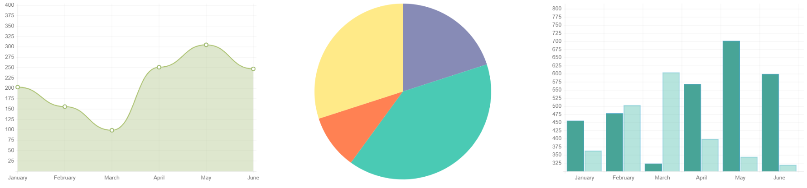
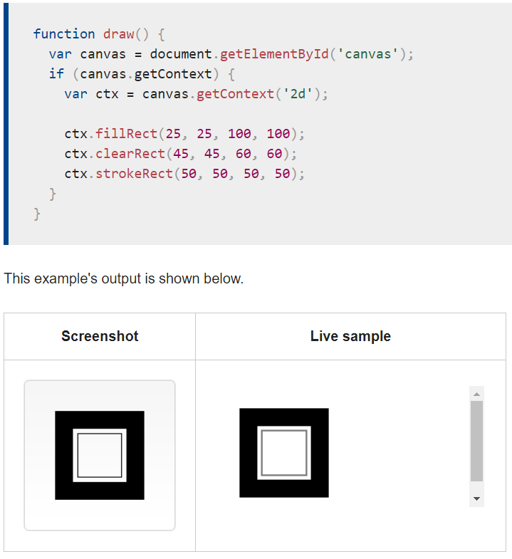
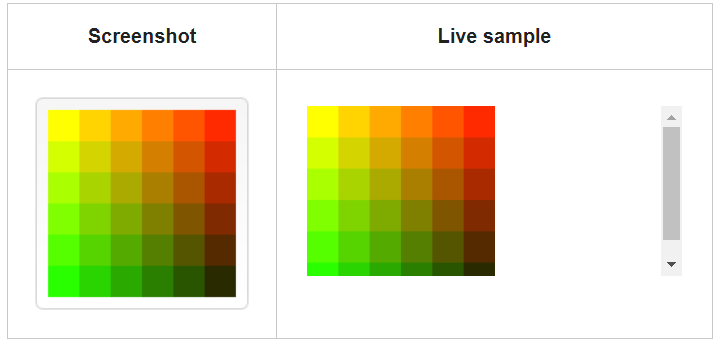
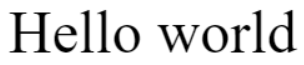
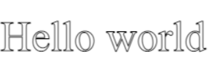

# Chart.js

chart.js is way to get started with charts and use the charts easier like: bar charts, line charts, pie charts.

To start using charts should download `chart.js` then copy this folder to VS then import `` in HTML.
After that we can drow charts:

1. line chart.
2. pie chart.
3. bar chart.

we should write `canvas` element in HTML page then can do any of these charts

Can also add `id`,`width`,`height`for canvas.

### Drawing shapes with canvas

there are three functions to drow rectangle:

1. fillRect(x, y, width, height)
2. strokeRect(x, y, width, height)
3. clearRect(x, y, width, height)

and have parameters ti spicify the position.

### Drawing paths

Used to stroke or fill the path to render it can use these functions to perform :

- beginPath(): use to create path.
- closePath(): use to add straight lineto the path.
- stroke(): use to draw the shape by stroking its outline.
- fill(): use to fill the path.

### Colors

Can add colors for shaps by use :
- fillStyle = color: add style when filling shapes.
- strokeStyle = color: add style for shapes' outlines.

### Drawing text

To render the text can use:

- fillText(text, x, y [, maxWidth])  
- strokeText(text, x, y [, maxWidth])   

And styling text by :

- font = value
- textAlign = value
- textBaseline = value
- direction = value

