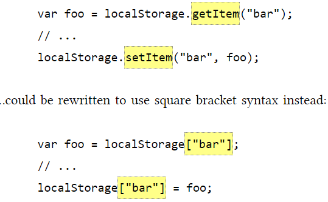

# THE PAST, PRESENT & FUTURE OF LOCAL STORAGE FOR WEB APPLICATIONS 

Cookies were invented for storage small small amount of data but have these cookies three potentially dealbreaking downsides:

1. Cookies include with every HTTP request that makes it slow.
2. Cookies include with every HTTP request that makes it sending data unencrypted over the internet.
3. Cookies are limited to about 4 KB of data that makes it slow.

HTML5 : way to store web pages locally within the client web browser this data is never transmitted to the web server.

and these browsers support HTML5:

- IE 8.0+
- FIREFOX 3.5+	
- SAFARI 4.0+	
- CHROME 4.0+	
- OPERA	10.5+
- IPHONE 2.0+
- ANDROID 2.0+

if You store data based on a named key, then you can retrieve that data with the same key. if you store string and want to retrive integer should write `parseInt()` or if you want retrive float `parseFloat()`.

- Calling `setItem()` giveing value for the previous value.

- Calling `getItem()` return null rather than throw an exception.

- Calling `removeItem()` removing the values and keys.

