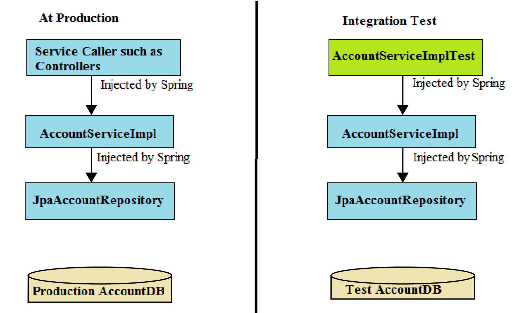

## Working with Relationships in Spring Data REST

1. One-to-One Relationship

1. The Data Model

A one-to-one relationship refers to the relationship between two entities/database tables A and B in which only one element/row of A may only be linked to one element/row of B, and vice versa.

2. 2. The Repositories --> public interface LibraryRepository extends CrudRepository<Library, Long> {}

3. Creating the Resources
4. .4. Creating the Associations:  After persisting both instances, we can establish the relationship by using one of the association resources.This is done using the HTTP method PUT, which supports a media type of text/uri-list, and a body containing the URI of the resource to bind to the association.

