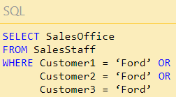

# Database Normalization

process used to organize a database into tables and columns, that reduce duplicate the data, minimize or avoid data modification issues, and the third is to simplify queries.

### Insert Anomaly

In a table insert the sales office, we cannot enter the sales office until we enter the salesperson because we need the employee's ID .

### Update Anomaly
### Deletion Anomaly

- Search and Sort Issues :it is making easier to search and sort the data.if you want to search about specific column by write:

# Definition of Normalization

- First Normal Form – The information is stored in a relational table and each column contains atomic values, and there are not repeating groups of columns.

- Second Normal Form – The table is in first normal form and all the columns depend on the table’s primary key.

- Third Normal Form – The table is in second normal form and all of its columns are not transitively dependent on the primary key.

