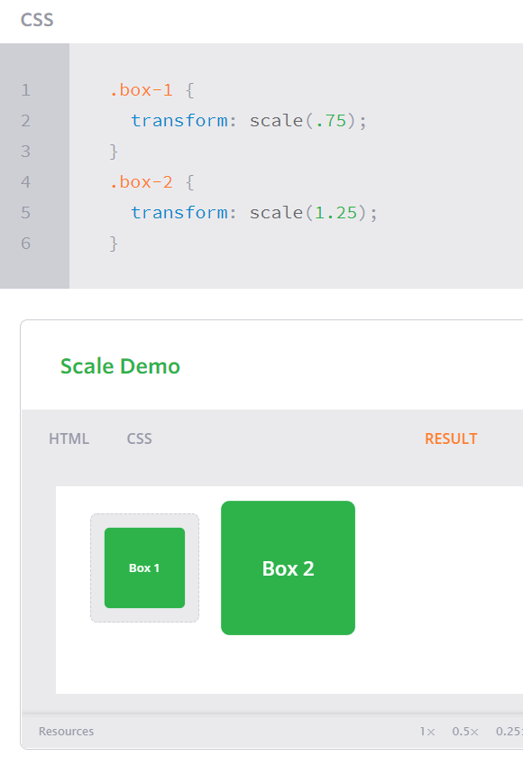

# Transforms

Transform come with two-dimensional and three-dimensional transforms.

- Two-dimensional transforms work on the x and y axes,(horizontal and vertical axes).
- Three-dimensional transforms work on the x and y axes, and the z axis.

2D Rotate : can rotate the element from 0 to 360 degrees and the defult value is 50% .

2D Scale : when use scale can control in element size if value between .01 and .99 element will be smaller and if value 1.01 will be larger.

# Transitions & Animations

Transitions : can use pseudo-classes in styles : `:hover, :focus, :active, :target`.

transition properties: 

- transition-property
- transition-duration :using timing values like seconds (s) and milliseconds (ms).
- transition-timing-function
- transition-delay

# Animations

When spicifiy the name of animation in HTML write name of animation after @keyframes then write percentage to spicify the position.

there are some transition like :

1. Fade in
2. Change color
3. Grow & Shrink
4. Rotate elements
5. Square to circle
6. 3D shadow
7. Swing
8. Inset border
