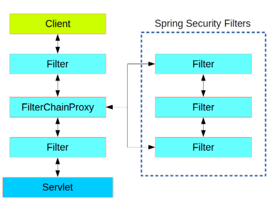

# Spring Security Architecture

- Application security 
1. authentication :who are you?
has main strategy interface `AuthenticationManager` and has this method:

***  Authentication authenticate(Authentication authentication)
    throws AuthenticationException;
}***

- `AuthenticationProvider` : has an extra method to allow the caller to query whether it supports a given Authentication 

Spring Security provides some configuration helpers to quickly get common authentication manager features set up in your application `AuthenticationManagerBuilder`

2.  authorization :what are you allowed to do? ----> access control

core strategy in authorization is AccessDecisionManager.

### Web Security

The client sends a request to the application, and the container decides which filters and which servlet apply to it based on the path of the request URI.

Principal : used to validate the authentication, so this can be a useful little trick to get a type-safe reference to your user data.