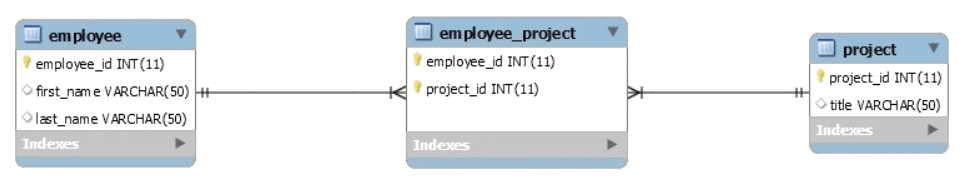

# Hibernate Many to Many

A many-to-many relationship occurs when multiple records in a table are associated with multiple records in another table. For example, a many-to-many relationship exists between customers and products: customers can purchase various products, and products can be purchased by many customers.

Let's start with a simple Entity Relationship Diagram – which shows the many-to-many association between two entities employee and project:

` @ManyToMany(cascade = { CascadeType.ALL }) `

`  @JoinTable(`

` name = "Employee_Project", `

`joinColumns = { @JoinColumn(name = "employee_id") },` 

`inverseJoinColumns = { @JoinColumn(name = "project_id") }`

`)`

`Set<Project> projects = new HashSet<>(); `

The @ManyToMany annotation is used in both classes to create the many-to-many relationship between the entities.

This association has two sides i.e. the owning side and the inverse side. In our example, the owning side is Employee so the join table is specified on the owning side by using the @JoinTable annotation in Employee class. The @JoinTable is used to define the join/link table. In this case, it is Employee_Project.
