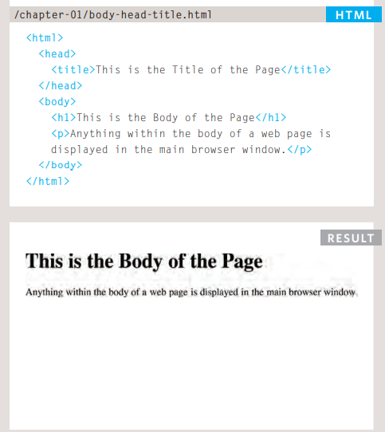

# HTML Describes the Structure of Pages

HTML has several semantic elements that define the different parts of a web page:
Header
`<header></header>`

<h1> headings should be used for main headings, followed by <h2> headings, then the less important <h3>, and so on.

Paragraphs

 

A paragraph always starts on a new line, and is usually a block of text.

Links
<a href="#">This is a link</a>

You met the <body> element in the first example we created. Everything inside this element is
shown inside the main browser window.

Before the <body> element you will often see a <head> element. This contains information
about the page (rather than information that is shown within the main part of the browser
window that is highlighted in blue on the opposite page). You will usually find a <title>
element inside the `<head>` element.

[complete the next page](https://judyal-taweel.github.io/reading-notes02/read201b)
