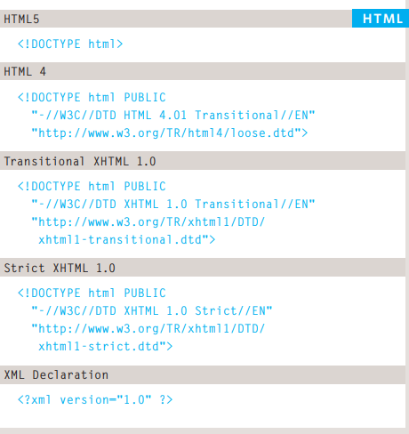

# The Evolution of HTML

Because there have been several versions of HTML, each web page should begin with a DOCTYPE declaration to tell a
browser which version of HTML the page is using.

### Comments in HTML

`<!-- -->`
If you want to add a comment to your code that will not be visible in the user's browser, you
can add the text between these characters:
`<!-- comment goes here -->`

### ID Attribute

Every HTML element can carry the id attribute. It is used to uniquely identify that element from other elements on the
page. Its value should start with a letter or an underscore (not a number or any other character). It is important that no two elements on the same page
have the same value for their id attributes (otherwise the value is no longer unique).

### Class Attribute

Every HTML element can also carry a class attribute. Sometimes, rather than uniquely identifying one element within
a document, you will want a way to identify several elements as being different from the other elements on the page.

### Block Elements

Examples of block elements are
`<h1>`, `
`, `<ul>`, and `<li>`

### Inline Elements

Examples of inline elements are
`<a>`, `<b>`, `<em>`, and ``.

### Grouping Text & Elements In a Block

The `
` element allows you to group a set of elements together in one block-level box.

### IFrames

An iframe is like a little window that has been cut into your page — and in that window you can see another page. The term
iframe is an abbreviation of inline frame.

### Escape Characters

