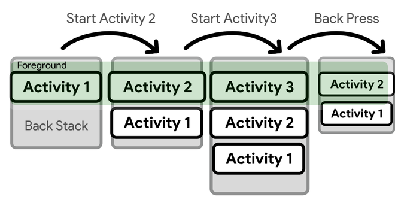

# Understand Tasks and Back Stack

When the current activity starts another, the new activity is pushed on the top of the stack and takes focus. The previous activity remains in the stack, but is stopped. When an activity stops, the system retains the current state of its user interface. When the user presses the Back button, the current activity is popped from the top of the stack (the activity is destroyed) and the previous activity resumes (the previous state of its UI is restored). Activities in the stack are never rearranged, only pushed and popped from the stack—pushed onto the stack when started by the current activity and popped off when the user leaves it using the Back button. As such, the back stack operates as a "last in, first out" object structure. Figure 1 visualizes this behavior with a timeline showing the progress between activities along with the current back stack at each point in time.



### To summarize the default behavior for activities and tasks:

- When Activity A starts Activity B, Activity A is stopped, but the system retains its state (such as scroll position and text entered into forms). If the user presses the Back button while in Activity B, Activity A resumes with its state restored.

- When the user leaves a task by pressing the Home button, the current activity is stopped and its task goes into the background. The system retains the state of every activity in the task. If the user later resumes the task by selecting the launcher icon that began the task, the task comes to the foreground and resumes the activity at the top of the stack.

- If the user presses the Back button, the current activity is popped from the stack and destroyed. The previous activity in the stack is resumed. When an activity is destroyed, the system does not retain the activity's state.

- Activities can be instantiated multiple times, even from other tasks.

### In this regard, the principal <activity> attributes you can use are:

- taskAffinity
- launchMode
- allowTaskReparenting
- clearTaskOnLaunch
- alwaysRetainTaskState
- finishOnTaskLaunch

### And the principal intent flags you can use are:

- FLAG_ACTIVITY_NEW_TASK
- FLAG_ACTIVITY_CLEAR_TOP
- FLAG_ACTIVITY_SINGLE_TOP

## Save key-value data

If you have a relatively small collection of key-values that you'd like to save, you should use the SharedPreferences APIs. A SharedPreferences object points to a file containing key-value pairs and provides simple methods to read and write them. Each SharedPreferences file is managed by the framework and can be private or shared.

```Context context = getActivity();
SharedPreferences sharedPref = context.getSharedPreferences(
        getString(R.string.preference_file_key), Context.MODE_PRIVATE);
```

```
SharedPreferences sharedPref = getActivity().getPreferences(Context.MODE_PRIVATE);
```

If you're using the SharedPreferences API to save app settings, you should instead use getDefaultSharedPreferences() to get the default shared preference file for your entire app. For more information, see the Settings developer guide.

```
SharedPreferences sharedPref = getActivity().getPreferences(Context.MODE_PRIVATE);
SharedPreferences.Editor editor = sharedPref.edit();
editor.putInt(getString(R.string.saved_high_score_key), newHighScore);
editor.apply();
```
- Read from shared preferences

```
SharedPreferences sharedPref = getActivity().getPreferences(Context.MODE_PRIVATE);
int defaultValue = getResources().getInteger(R.integer.saved_high_score_default_key);
int highScore = sharedPref.getInt(getString(R.string.saved_high_score_key), defaultValue);
```

