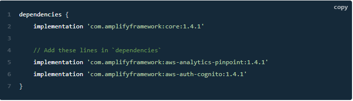
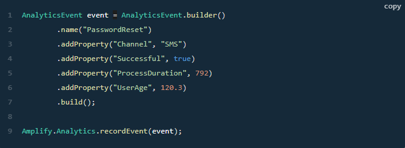

## Amplify and Kinesis
- Analytics category enables you to collect analytics data for your App.

- Steps to setup and configure your application with Amplify Analytics:

        Run command in terminal :` amplify add analytics`
        Answer to next three questions: Amazon Pinpoint, 'providePinPointResrouceName', Yes
        Run command in terminal: `amplify push`
        Install dependencies

Add the following categories:
Amplify.addPlugin(new AWSCognitoAuthPlugin());
Amplify.addPlugin(new AWSPinpointAnalyticsPlugin(this));
To record an event, create an AnalyticsEvent and call Amplify.Analytics.recordEvent() to send it
Record Event with Amplify Analytics

Run command in terminal: Amplify console analytics