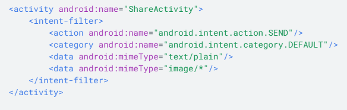
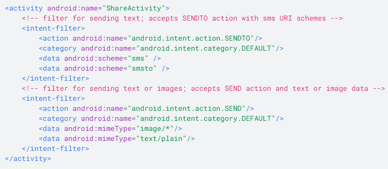

## Intent Filters
- Allow other apps to start your activity by adding `<intent-filter>` element in manifest file for corresponding `<activity>` element.
- Components for intent filter
    - Action - A string naming the action to perform specified with `<action>` element
    - Data - A description of the data associated with the intent specified with the `<data>` element
    - Category - Gives an additional way to characterize the activity handling the intent specified with the <category> element
### Example of the intent filter in the manifest file below:

- It's okay to have multiple elements within each intent filter, but should create separate intent filters to specify which actions are acceptable when paired with which data type.
- For example, suppose your activity handles both text and images for both the ACTION_SEND and ACTION_SENDTO intents.
Example of when you should separate the intent filters shown below.

- To handle intent, you first need to read it.
   - Call `getIntent()` to retrieve the intent that started the activity.
   - Usually want to do this early own within onCreate
- If you want to return a result to the activity that invoked yours, call setResult() to specify the result code and result Intent.
   - Then call finish() to close your activity.