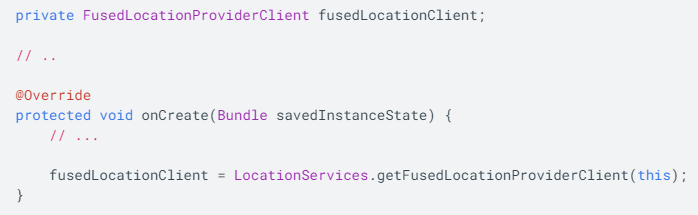
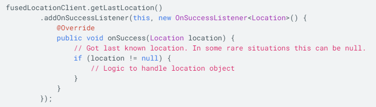

## Location
- Use the fused location provider (Google PLay services location API's) for your app to locate the user's device.
   - The service provides specific requirements at high level
    - Also optimizes the device's use of battery power
- Set up Google Play services
   - Set up dependencies in build.gradle file since we are using getLastLocation() method, we use:
        - implementation 'com.google.android.gms:play-services-location:17.1.0'
    - Within the onCreate() method create instance of the Fused Location Provider Client. Example below:

- The precision of the location returned by the getLastLocation() method is determined by the permission setting you put in the app manifest
   - Within a service element, declare a foreground service type of location
    - To request foreground location access declare one of the permissions below in the manifest file
        - `<uses-permission android:name="android.permission.ACCESS_COARSE_LOCATION" />`
        - `<uses-permission android:name="android.permission.ACCESS_FINE_LOCATION" />`

- Steps to include more accurate results:
    - Check whether the location retrieved is significantly newer than the previously fetched location.
     - Check whether the accuracy claimed by the location is better or worse than that of the previous estimate.
      - Check the provider that's associated with the new location. Decide whether you trust this provider more than the one used in your app's cache location.